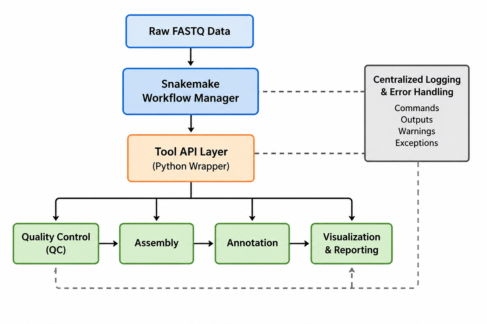

```{=typst}
#set page(margin: (x:0.5in, y:0.5in))
#show link: set text(fill: blue)
#align(center)[

    = Mitogenome Batch Processing Pipeline Architectural Design Record
    == Emil Cacayan

]
```

---

# Table of Contents
1. [Executive Summary and Project Goals](#executive-summary-and-project-goals)
2. [Architectural Design Record (ADR)](#arhitectural-design-record-adr)
3. [Repository Structure and Project Design](#repository-structure-and-project-design)
4. [Data Sources](#data-sources)
5. [Overall Workflow Design](#overall-workflow-design)
6. [Pipeline Workflow Management, Tool API, Object Oriented-Style, and Error Logging](#pipeline-workflow-management-tool-api-object-oriented-style-and-error-logging)
7. [Quality Control](#quality-control)
8. [Read Trimming and Filtering](#read-trimming-and-filtering)
9. [Assembly](#assembly)
10. [Genome Annotation, Visualization, and Phylogenetic Comparisons](#genome-annotation-visualization-and-phylogenetic-comparisons)
11. [Statistics Generation of Assembled Genomes](#statistics-generation-of-assembled-genomes)
12. [References](#references)

# Executive Summary and Project Goals
## Project Objective 
The goal of this project is the development of a pipeline which will batch process and assemble raw reads of whole genome (including mitochondrial DNA) into completed mitogenomes that comprise a reference database for fish species in Illinois. This reference database would ideally then be published to NCBI GenBank and compiled into a microbiology resource announcement. 

For the creation of this pipeline, additional focus will be on documentation, reproducibility, error handling and logging, determination of data fidelity, and test-driven design. Progress of this project will be saved and tracked on GitHub (linked below): 

```{=typst}
#align(center)[
```
- [Repository](https://github.com/cacayan2/mitogenome-batch-processor.git)
- [Project](https://github.com/users/cacayan2/projects/3/views/1)
```{=typst}
]
```

---

## Background and Motivation
One of the most difficult tasks that ecologists must overcome is tracking distribution of species of interest, particularly for those in freshwater ecosystems. Traditional surveys typically require catching fish, netting insects, sampling fixed species such as mussels, and sending biologists into the field for these non-trivial and time intensive tasks (Schilling et al., 2022). These surveys are infrequent and expensive, and particularly for conservation agencies who have a vested interest in the distribution of species, their potential to become threatened, and an empirical determination of environmental impacts of urban activity, this information can be quite valuable. One of the ways that biologists have overcome this bottleneck is via metabarcoding. 

DNA barcoding was a technique introduced in 2003 by Paul Herbert who proposed that using a short standardized DNA sequence (often the mitochondrial cytocrome c oxidase subunit I gene) as a "barcode" that could be used to identify species (Mohammed et al., 2017). This barcode could be matched to a reference database in order to quickly determine the species the mitogene belonged to. Mitochondrial DNA has a few distinct advantages over using genomic DNA for species identification:

- Easier to detect in degraded samples
    + mtDNA is present in high copy number per cell compared to genomic DNA (Merheb et al., 2019; Mohammed et al., 2017)
    + Mitochondrial genomes are small, circular rings of DNA physically packaged inside the mitochondria, offering additional protection against degradation (Merheb et al., 2019; Mohammed et al., 2017)
- Conserved enough to amplify easily (Singh et al., 2017)
- Variable enough to distinguish between species (Singh et al., 2017; Mohammed et al., 2017)

In the late 2000's, next-generation sequencing allowed for higher-fidelity higher-throughput processing of environmental samples of DNA (called eDNA) (Yoon et al., 2025). This allows for the simultaneous sequencing of entire ecological communities contained within a single ecosystem. This DNA could be barcoded against a reference database, and became known as metabarcoding and was applied to soils, lakes, forests, and gut microbiota. 

The Stuart Lab is interested in studying the distribution of freshwater fish along the length of the Fox River (Illinois River Tributary), which flows southwest from southeastern Wisconsin down into northeastern Illinois. This 202-mile-long river originates at Colgate, Wisconsin and crosses into northern Illinois to form the famous Fox Chain O'Lakes, and continues to meander south until it joins the Illinois River at Ottawa, Illinois (Fox River Watershed | Lake County, IL, 2023). 

Ecologically, this river serves a few essential functions:

**1. High-Density Interaction Corridor for Urban Wildlife:**

<br><small>This river serves a niche as a vital ecological oasis inside one of the most highly urbanized and agricultural regions in the United States. This river cuts through the densely populated Chicago suburban collar known as the Fox Valley (Fox River, 2025). The river runs through key portions of forest preserves in the Northwest Suburbs of Illinois (McHenry, Kane, and Will counties) and allows terrestrial and semi-acquatic wildlife (river otters, minks, foxes, and deer) to migrate, forage, and breed without being trapped by suburban sprawl (Fox River, 2025). The river also serves as a massive regional sponge, capturing stormwater runoff to prevent flooding in the larger Chicago metro area and surrounding suburbs (Baldwin, 2026). </br></small>

**2. Refuge for Threatened Freshwater Mussels:**

<br><small>The Illinois Fox River basin is significant for its biodiversity of native freshwater mussels (supporting 24 to 32 distinct species) (Schanzle et al., 2004). Millions of these mussels act as a natural filter for bacteria and algae (up to 10 gallons of water a day) cleaning the water column (Black et al., 2017). The reproductive cycle of these species are quite complex, many requiring larvae to attach to the gills of native fish to grow (Rock et al., 2022). The Fox River provides the multi-species environment for this fragile paradigm to survive - many of these fish species are threatened (such as the Plain Pocketbook, Elktoe, and White Heelsplitter) (Altenritter & Casper, 2018; Shasteen et al., 2013; Limpers 2022). </br></small>

**3. Native Fish Nursery:**

<br><small> The Fox River is a premier warmwater habitat that hosts nearly 100 native fish (State of the Fox River Report 2003, n.d.). It supports robust populations of apex game fish such as Smallmouth Bass, Flathead Catfish, and Walleye, which keep smaller fish populations healthy and balanced (State of the Fox River Report 2003, n.d.). Feeding streams that branch off the main river (namely Nippersink Creek and Ferson Creek) act as clean, high-quality spawnning grounds where sensitive species lay eggs away from the main river (State of the Fox River Report 2003, n.d.). </br></small>

One important ecological shift currently occurring in the river is a transition that is largely being facilitated by man. Obsolete industrial dams fragmented the Illinois portion of the river into disconnected pools, preventing migration to upstream spawning creeks, lowering oxygen levels, and caused heavy siltation that suffocated mussel beds (Carpentersville Dam Removal Project - Resource Environmental Solutions, LLC, 2025). While removal of these dams allows for a transition to a free-flowing aquatic highway, it is important to track pre-removal and post-removal changes in the ecological distribution of different species present within the Fox River, as a major concern of residents along the Fox River is fish loss and alleviating this concern is a major goal of ecological conservation groups such as Friends of the Fox River (Y. Stuart, Research Proposal). 

Metabarcoding would allow for a nearly synchronous view of the state of an ecological population and trend of population distribution over time with minimal logistical and financial overhead, and would be directly applicable to the study of fish population following dam removal in the Fox River. This method could be further applied to other methods, such as studying the effects of urban and agricultural development and runoff, determination of threatened or endangered species, and the studying of fish migratory patterns. But the one caveat to metabarcoding is: **any metabarcoding workflow is only as good as its reference database.**

The goal of the development of this pipeline is to create a reference database of mitochondrial genomes obtained from next generation sequencing of DNA extracted from fish  (covering ~140 fish species) (Y. Stuart, Research Proposal). This database, if completed, would be one of the most thorough eDNA metabarcoding reference databases in the world (Y. Stuart, Research Proposal). Eventually, all mitogenomes will be accessionged to NCBI's GenBank repository, this database will be available for use by researchers and managers throughout the Great Lakes, Mississippi River, and beyond to support conservation and restoration projects (Y. Stuart, Research Proposal). 

---

```{=typst}
#pagebreak()
```

## Initial Goals
```{=typst}
#rect(fill: luma(245), width: 100%, inset: 15pt)[
```
### Goal 1: Understand Existing Workflow
- Review funded proposal documentation and Richa Patel's thesis workflow
- Examine published mitogenome announcement papers
- Identify required inputs, outputs, and manual steps

**Deliverable:**

- A design plan documenting the current process and architectural design record containing current tools, strengths, limitations, etc.

**Notes:** Current workflow looks like `fastp` → `GetOrganelle` → `MitoZ`. A complete diagrammatic workflow of Richa Patel's pipeline can be found [here](https://ecommons.luc.edu/cgi/viewcontent.cgi?article=2463&context=ures).
```{=typst}
]
```

```{=typst}
#rect(fill: luma(245), width: 100%, inset: 15pt)[
```
### Goal 2: Development of Reproducible Processing Pipeline

Develop scripts that can: 

- Import raw data
- Organize project structure
- Perform QC
- Generate standardized outputs
- Perform robust logging and error reporting

**Deliverable:** 

- Version-controlled pipeline repository

**Note:** Considering using Nextflow or Snakemake to automate the pipeline. Also investigate seed sequences required for different tools in pipeline. 
```{=typst}
]
```

```{=typst}
#rect(fill: luma(245), width: 100%, inset: 15pt)[
```
### Goal 3: Automate Genome Statistics Reporting

Automatically calculate genome length, GC content, gene counts, coverage metrics, other statistics and visualize as a table. 

**Deliverable:**

- Automatically generated summary table of relevant statistics
```{=typst}
]
```

```{=typst}
#rect(fill: luma(245), width: 100%, inset: 15pt)[
```
### Goal 4: Automate Genome Statistics Reporting

Investigate automated generation of: 

- Circularized mitochondrial genome maps
- Gene organization figures
- QC visualizations

**Deliverable:**

- Publication-ready figures generated from pipeline
```{=typst}
]
```

```{=typst}
#rect(fill: luma(245), width: 100%, inset: 15pt)[
```
### Goal 5: Automate Phylogenetic Analysis

Develop procedures for: 

- Reference sequence retrieval
- Sequence alignment
- Tree construction
- Figure generation

**Deliverable:**

- Reproducible phylogenetic analysis
```{=typst}
]
```

```{=typst}
#rect(fill: luma(245), width: 100%, inset: 15pt)[
```
### Goal 6: Automated Reporting

Generate standardized Markdown reports documenting:

- Genome statistics
- Figures
- Phylogenetic results
- Submission metadata

**Deliverable:**

- Automatically generated report for each species, and automatic archiving to GenBank and NCBI. 
```{=typst}
]
```
---

## Proposed Development Strategy
### Phase 1 - Literature and Workflow Review
- Understand dataset and current methodology
- Identify opportunities for improvement

### Phase 2 - Pipeline Prototyping
- Build core scripts
- Test on small number of species

### Phase 3 - Validation
- Compare outputs against previously completed analysis
- Verify reproducibility
- Draft, finalize, and submit midsemester report

### Phase 4 - Scaling
- Process larger batches of species, identify areas of improvement for automation and runtime

### Phase 5 - Documentation
- Finalize [`README.md`](https://github.com/cacayan2/mitogenome-batch-processor.git) as a user guide, including
    + Installation instructions
    + Overall pipeline documentation

### Phase 6 - Manuscript Creation
- Finalize creation of manuscript and presentation. 

---

## Expected Outcomes
- Reproducible mitrochondrial genome processing pipeline
- Reduced manual effort for future projects
- Standardized outputs across species
- Automated report generation
- Foundation for large-scale mitogenome processing

---

## Questions for Discussion
- Which portions of the current workflow are considered highest priority to automate?
- What software tools are currently utilized for the current workflow? Are there alternatives? 
- Are there existing datasets that can be utilized for validation?

---

# Arhitectural Design Record (ADR)
## Context and Technology Choice
An architectural design record (ADR) is a document that outlines components, processes, tools, and design justifications for the development of software or system. The goal is to maintain transparency, reproducibility, and maintainability of created software or system. It serves as a starting point for discussions and decisions particularly for collaborative types of projects or projects that will continue development into the future. An entry for this  follows this format:

- [Section Title (Usually A Step or Choice in Workflow Development)]
    + Context and Technology Choice
    + Justifications

## Justifications
This project was written in the context that it would be reused again in the future, whether to generate new mitogenomes or further development as tools improve or larger tasks evolve, so more robust documentation than that provided with a user manual and in-code commenting would further improve the project to this end. An architectural design record shows the thought process behind the code that ended up in the project, ensuring that both users and future developers understand the logic behind decisions made.

---

# Repository Structure and Project Design
The mitogenome batch processor is expected to evolve into a multi-stage bioinformatics pipeline consisting of quality control, read preprocessing, assembly, annotation, phylogenetic validation, statistics generation, reporting, and workflow orchestration. Development is being conducted within a short turnaround internship timeline, requiring a balance between maintainability, scalability, and project transparency. 

To support these goals, a source-layout Python repository structure combined with GitHub Issues and GitHub Projects was selected. 

**Links to Both:**

```{=typst}
#align(center)[
```
- [Repository](https://github.com/cacayan2/mitogenome-batch-processor.git)
- [Project](https://github.com/users/cacayan2/projects/3/views/1)
```{=typst}
]
```

The repository is organized into several major components:

- `src/mitopipeline/` for reusable Python package code.
- `ctrl/` for Snakemake rules and configuration.
- `tests/` for unit tests, integration tests, and fixtures.
- `envs/` for Conda environment definitions.
- `zmisc/docs/` for documentation and other miscellaneous artifacts.
- `zmisc/legacy/` for historical scripts and reference implementations.

Project management is performed through GitHub Issues and a GitHub Project board. Development is tracked by epics representing major pipeline milestones: 

- Repository Foundation
- Workflow Infrastructure
- Snakemake Architecture
- Quality Control
- Read Preprocessing
- Assembly
- Annotation
- Reporting
- Phylogenetic Validation
- Testing
- Production Readiness

Each issue contains a goal, implementation background, task list, deliverables, and acceptance criteria. Issues are scheduled according to the internship timeline and progresses through the following statuses:

- Ready
- In Progress
- Late
- In Review
- Done

## Justification
The source-layout repository structure separates orchestration from reusable code, creating a boundary between Snakemake and Python implementation. This supports the project's object-oriented architecture and allows for easier expansion of tool API's, statistics models, reporting systems, and pipeline management classes without coupling them to implemented definitions.

Using dedicated directories for testing, environment management, documentation, and legacy scripts allows the repository to remain organized throughout development and reduces the cognitive and logistic overhead associated with navigating a codebase. The structure aligns with common Python packaging practices and encourages reproducible software development.

GitHub Issues serve as both implementation tasks and lightweight technical specifications. By embedding goals, background information, deliverables, and acceptance criteria directly into issues, the context of pipeline development remains associated with the work itself rather than distributed across external notes or conversations. This reduces ambniguity and provides a persistent record of project decisions.

The GitHub Project board provides a centralized view of project status and internship progress - organizing issues into epics enables high-level progress tracking while preserving visibility into individual implementation tasks. This simplifies project-management overhead while still providing clear insight into status.

Together, the repository structure and issue-based development process establish a framework for organizing code, documentation, testing, and execution. This system promotes maintainability, reproducibility, traceability of decisions, and ease of future handoff to other developers or laboratory personnel. 

# Data Sources
At the time of development, two primary sequencing datasets are available on the laboratory workstation and will serve different purposes throughout the project lifecycle. 

## Pilot Dataset (`mitogenome_extra`)
The `mitogenome_extra` directory contains a pilot dataset consisting of approximately fifteen fish species. This dataset was generated prior to the start of this project and contains both raw sequencing reads and outputs from previous assembly experiments, including quality-control reports, assembly artifacts, and intermediate processing files. The dataset appears to have been used to evaluate assembly workflows and software configurations prior to acquisition of larger sequencing collections. 

Because of its smaller size and existing processing history, this dataset will serve as the primary development and validation dataset during early pipeline construction. Workflow components, error handling, logging, reporting, and reproducibility features will be developed and tested against this dataset before being applied to larger sequencing collections.

## May 2026 Sequencing Dataset (`mitogenome_May2026`)
The `mitogenome_May2026` directory contains a substantially larger sequencing collection consisting of approximately 130 mitochondrial DNA samples. This dataset was obtained through a sequencing project and includes sequencing archives, QC reports, and associated metadata. Currently, this dataset is considered the primary candidate for large-scale pipeline validation and performance testing.

While this dataset represents the largest sequencing collection currently available, it should not be assumed to represent the final  production dataset for the project. Additional sequencing collections may become available as the broader mitochondrial reference database effort progresses. 

## Future Data Sources
The long-term objective of the project is the generation of a curated mitochondrial reference database for freshwater fish species relevant to Fox River biodiversity monitoring and environmental DNA (eDNA) metabarcoding studies. As additional sequencing datasets become available, the pipeline should be capable of processing new species with minimal modification, supporting large-scale mitochondrial genome assembly, annotating, reporting, and eventual accessioning to public repositories such as NCBI GenBank. 

---

# Overall Workflow Design
## Context and Technology Choice
The pipeline follows a sequential mitochondrial genome processing workflow beginning with raw paired-end sequencing reads and ending with visualization and summary reports. The selected workflow consists of five primary stages:

**1. Quality Control (QC)**
    
- Assess raw sequencing quality.
- Identify adapter contamination, low-quality base calls, sequence duplication, and other sequencing artifacts.

**2. Read Trimming and Filtering**

- Remove adapter sequences.
- Trim low-quality regions.
- Filter reads that fail predefined quality thresholds.

**3. Mitochondrial Genome Assembly**

- Assemble mitochondrial genomes from filtered sequencing reads.
- Generate contigs and candidate mitochondrial genome sequences suitable for downstream analysis. 

**4. Genome Annotation**

- Identify mitochondrial genes, rRNA genes, tRNA genes, and other genomic features.
- Generate standardized annotation files for downstream reporting and database integration.
    
**5. Visualization and Reporting**

- Produce mitochondrial genome maps and assembly summary statistics. 
- Generate publication-ready figures and automated reports to support future database development and manuscript preparation. 

## Justifications
The selected workflow reflects established practices in mitochondrial genomics and provides a reproducible framework that can be applied consistently across large numbers of species. Quality control is performed before any downstream processing to ensure that sequencing artifacts are identified early and do not propogate through the remainder of the pipeline. Trimming and filtering improve assembly quality by removing low-confidence sequence information that may negatively impact graph construction and contig generation.

Assembly is performed prior to annotation because genomic features can only be reliably identified once a candidate mitochondrial genome has been reconstructed. Annotation then converts assembled sequences into meaningful information by identifying genes and other functional elements.

Visualization is positioned as the final stage because it depends on outputs generated throughout the workflow, including assembly metrics and annotation results. Separating visualization from assembly and annotation allows reporting tools to evolve independently while preserving the underlying analysis workflow.

This staged design promotes modularity, reproducibility, and scalability. Individual components can be replaced or improved without requiring redesign of the entire pipeline, allowing the workflow to adapt as new sequencing datasets, assembly tools, and annotation methods become available. 

---

# Pipeline Workflow Management, Tool API, Object Oriented-Style, and Error Logging
## Context and Technology Choice
The pipeline will be orchestrated using [`Snakemake`](https://snakemake.readthedocs.io/en/stable/) as the workflow management system. Individual bioinformatics tools will not be invoked directly from workflow definitions. Instead, each tool will be accessed through a dedicated Python API layer responsible for command construction, parameter validation, execution, and result reporting.

A centralized logging framework will be implemented to separate user-facing progress updates from detailed execution logs. Terminal output will be reserved for major workflow milestones, pipeline progress, warnings, and critical failures, while comprehensive execution details will be written to persistent log files.

The resulting architecture consists of three primary layers:



**1. Workflow Orchestration Layer (Snakemake)**

- Defines pipeline dependencies and execution order.
- Manages parallelization and resource allocation.
- Handles workflow reproducibility and restart capabilities.

**2. Tool API Layer**

- Encapsulates individual bioinformatics tools.
- Validates inputs and parameters.
- Constructs tool-specific commands.
- Standardizes execution behavior across software packages. 

**3. Logging and Monitoring Layer**

- Captures execution events and runtime metrics.
- Records tool commands, outputs, warnings, and errors.
- Provides user-friendly progress reporting while preserving detailed diagnostic information.
- This will be done with the creation of a logging object via the `logging` module. This is stored in `src/mitopipeline/logging` and multiple sanity checks are in place to ensure appropriate use of logging objects.

In addition to the aforementioned layers, much of the philosophy behind the design of each individual code will be drawn from object-oriented design. Objects will be made for the following: 

- `API`: With this object, we standardize what an API is allowed to do and set a contract on the expected behavior of a tool.
- `Sample`: A sample object would ideally represent a single sample. For the lifetime of the pipeline, this object would retain information such as repository location, name, etc. 
- `PipelineJob`: A pipeline job would represent one full pipeline run and would store statistics, manage outputs, etc.
- `CommandResult`: Following the output of a command, associated behavior and variables will be stored in a separate object - this standardizes the output validation process. 

## Justifications
### Workflow Orchestration
Snakemake was selected as the workflow orchestration framework due to its development and intuitive back-end with Python, declarative workflow design, and widespread adoption within bioinformatics. As the primary implementation languages for the project is Python, Snakemake provides a natural extension of the existing development environment whilst minimizing the learning curve associated with introducing additional domain-specific languages. 

Alternative workflow systems were considered, including Nextflow. While Nextflow provides powerful capabilities for large-scale workflow execution, its Groovy-based syntax introduces additional complexity and would require development in a languages ecosystem not utilized within the scope of this project. Given the project's requirements, existing Python expertise, and relatively fast delivery window, Snakemake offers a more maintainable and approchable solution while still providing robust dependency management, parallel execution, reproducibility, and workflow recovery.

Compared to traditional shell-script orchestration, Snakemake provides explicit dependency tracking, automatic execution ordering, timestamp tracking, and workflow recovery. These features significantly improve maintainability, scalability, and support test-driven development as the number of samples and processing stages increases.

### Tool API Orchestration
Direct construction of command-line tool invocations within workflow definition was purposely avoided. Instead, each tool will be accessed through a dedicated API wrapper.

This layer of abstraction provides several benefits: 

- Centralized command construction logic
- Parameter validation before execution
- Consistent handling of input and output paths
- Simplified migration between tool versions
- Improved testability of individual pipeline components
- Reduced duplication of execution logic throughout the codebase.

In encapsulating command construction within modules, workflow definitions remain focused on data flow and dependency management rather than software-specific implementation details.

### Logging and Error Management
Large-scale bioinformatics workflows frequently generate substantial amounts of output. In addition, the completion of the pipeline or some subset of the pipeline has significant time complexity, making it difficult to identify salient events during the lifetime of pipeline execution. To address this challenge, the pipeline will implement a layered logging strategy.

The user-facing console (terminal) will remain concise and primarily report:

- Pipeline initialization.
- Sample-level progress updates.
- Stage completion events
- Warnings requiring user attention. 
- Critical failures.

Detailed execution information will be recorded to persistent log files, including:

- Tool invocation parameters
- Constructed command strings
- Standard output and error streams
- Runtime statistics
- File generation events
- Validation results
- Exception/stack traces and failure diagnostics

This approach significantly improves usability during execution while preserved detailed information necessary for debugging, reproducibility, and post-run auditing. The resulting logs will provide sufficient information to reconstruct execution history and diagnose failures without overwhelming users with excessive terminal output. 

Object-oriented design was pulled from previous experience with Java and C++ and allows for a modular and easily interpretable reverse-engineering process for future developers. This allows for ease of adding future tool API's (should newer or better tools be found to suit the problem) and streamlines development process by codifying contracts of expected behavior for different entities in the pipeline. While Python's interpreted nature allows for easier *ad hoc* pipeline building, integrating object-oriented design principles elevate this project from a single application to a generalized pipeline that could even be adapted outside of generating mitochondrial genomes. 

---

# Quality Control
## Context and Technology Choice
The first stage of the pipeline consists of quality assessment of raw sequencing reads using FastQC. All paired-end FASTQ files will undergo quality analysis prior to any trimming, filtering, or assembly operations.

FastQC generates standardized quality-control reports that evaluate multiple characteristics of sequencing data, including per-base sequence quality, per-sequence quality scores, sequence length distribution, GC content distribution, adapter contamination, sequence duplication levels, and overrepresented sequences.

Quality-control reports will be generated for each sequencing dataset and retained as part of the pipeline to provide a permanent record of input data quality. 

## Justifications
Quality assessment is performed as the first stage of the workflow to establish a baseline understanding of sequencing quality before any modifications are made to the data. Early identification of sequencing artifacts allows problematic samples to be detected prior to downstream analysis, reducing likelihood of assembly failure and misleading results.

FastQC was selected because it is a widely adopted and well-validated quality-control tool within the bioinformatics community. Its standardized reports provide consistent metrics across dataset and facilitate comparison between samples, sequencing runs, and experimental conditions. 

Performing quality assessment before trimming preserves information about the original sequencing data and allows impact of subsequent preprocessing steps to be evaluated. Retaining both raw and processed quality metrics supports reproducibility and provides additional context when investigating assembly failures or unexpected results. 

---

# Read Trimming and Filtering
## Context and Technology Choice
Following quality assessment, sequencing reads will undergo preprocessing using `fastp`. This stage is responsible for removing low-quality sequence data and correcting common sequencing artifacts prior to mitochondrial genome assembly. 

The preprocessing workflow includes adapter sequence detection and removal, quality-based trimming of reads, removal of low-quality reads, filtering of reads below minimum length thresholds, and generation of preprocessing statistics and summary reports.

Input to this stage consists of raw paired-end `.fastq` files that have completed quality assessment. The output consists of cleaned paired-end `.fastq` files suitable for downstream assembly and annotation. 

In addition to performing trimming and filtering, `fastp` generates detailed quality metrics describing the modifications applied to each dataset. These reports will be retained as part of the pipeline to support reproducibility and quality assurance.

## Justifications
Sequencing reads frequently contain adapter contamination, low-quality bases, and other artifacts that can negatively impact downstream assembly performance. Removing these artifacts prior to assembly improves the quality of the resulting assembly graph and reduces the likelihood of generating fragmented or incorrect assemblies.

`fastp` was selected because it provides a comprehensive preprocessing solution within a single application. Unlike workflows that require multiple independent tools for adapter removal, quality trimming, and filtering, `fastp` integrates these capabilities into a single execution step while producing detailed quality-control metrics.

This tool was also selected for its performance, ease of automation, and suitability for large-scale batch processing. Its ability to automatically detect adapter sequences reduces the amount of dataset-specific configuration required and improves portability across future sequencing datasets.

By performing trimming and filtering as a dedicated preprocessing stage, downstream assembly tools receive a more consistent and reliable set of reads, improving reproducibility and reducing propogation of sequencing artifacts throughout the remainder of the pipeline. 

Retention of both pre-processing and post-processing quality metrics allows effectiveness of filtering decisions to be evaluated and provides additional context when diagnosing assembly quality issues. 

---

# Assembly 
## Context/Technology Choice
Following quality control and read preprocessing, mitochondrial genome assembly will be performed using `GetOrganelle`. `GetOrganelle` is a specialized assembly tool designed for the resconstruction of organellar genomes, such as mitochondrial and chloroplast genomes, from short-read sequencing data.

The assembly stage is responsible for identifying mitochondrial reads from the sequencing dataset, constructing assembly graphs from filtered reads, recovering candidate mitochondrial genome sequences, detecting potential circular mitochondrial genome structures, and producing assemblies suitable for downstream validation and annotation. 

Inputs to this stage consists of quality-filtered paired-end `.fastq` files generated during preprocessing. Outputs include assembled mitochondrial genome sequences, assembly graphs, assembly statistics, and associated diagnostic files generated by `GetOrganelle`. 

Assembly outputs will be retained to support downstream annotation, visualization, quality assessment, and troubleshooting activities. 

## Justifications
The primary objective of the project is the generation of complete mitochondrial genome references for future biodiversity monitoring and environmental DNA (eDNA) applications. Because mitochondrial genomes possess unique structural characteristics and frequently represent only a small fraction of total sequencing reads, a specialized assembly approach was preferred over other general-purpose genome assemblers (such as `Unicycler` or `SPAdes`).

`GetOrganelle` was selected due to its widespread adoption within organellar genomics workflows and its demonstrated ability to recover genomes directly from whole-genome sequencing datasets. Unlike general-purpose assemblers, GetOrganelle incorporates targeted strategies for identifying and assembling organellar DNA, improving assembly efficiency and reducing complexity of downstream analysis. 

Alternative assembly approaches were considered during pipeline design. However, GetOrganelle was selected as the initial assembly technology because it aligns with current workflows, has already been utilized during previous pilot analyses, and provides a balance between automation and interpretability. 

Because mitochondrial genome assembly success may vary between species and sequencing conditions, assembly outputs will be preserved and evaluated using downstream quality assessment metrics. This design allows future comparison of assembly technologies should other approaches become necessary as larger sequencing datasets are processed.

By isolating assembly as a dedicated workflow stage, the pipeline maintains flexibility while ensuring that downstream annotation and visualization components operate on a consistent and reproducible set of assembled sequences. 

---

# Genome Annotation, Visualization, and Phylogenetic Comparisons
## Context/Technology Choice
Following mitochondrial genome assembly, assembled sequences will undergo annotation using `MITOS2`. Annotation results will then be used to generate mitochondrial genome visualizations and support phylogenetic comparison against closely related species.

This annotation stage is responsible for identification of protein-coding genes, ribosomal RNA genes, transfer RNA genes, determination of gene boundaries and genomic organization, and generation of standardized annotation outputs suitable for downstream analysis. 

`MITOS2` annotation outputs will also serve as the basis for mitochondrial genome visualizations, allowing assembled genomes to be represented as publication-ready gene maps and summary figures. 

To provide biological validation of assembled genomes, each annotated mitochondrial genome will undergo sequence similarity analysis using NCBI BLAST. The six closest sequence matches will be retrieved and aligned with the assembled genome. These alignments will then be imported into `MEGA11` for phylogenetic analysis and tree construction.

The resulting phylogenetic trees will provide an additional mechanism for evaluating assembly quality and confirming that assembled genomes cluster with taxonomically related species. 

## Justifications
`MITOS2` was selected as the primary annotation platform because it supports fully local execution and can be integrated directly into an automated bioinformatics workflow. While the gold standard for annotation of fish mitochondrial genomes is `MitoAnnotator`, this and similar tools require submission to external web services. `MITOS2` enables reproducible large-scale processing while maintaining compatibility with automated pipeline execution.

The annotation outputs generated by `MITOS2` provide biologically meaningful interpretation of assembled mitochondrial genomes and serve as a prerequisite for visualization and comparison analyses. BY standardizing annotation, this pipeline ensures consistency in reporting and simplifies future database integration.

Visualization was incorporated as a dedicated workflow stage to improve interpretability of assembled genomes and facilitate manual review. Genome maps provide a rapid method for assessing gene order, gene completeness, and overall assembly structure. These visual outputs are also directly applicable to future publications, reports, and database resources. 

Phylogenetic validation was selected as an additional quality assurance mechanism because assembly statistics alone cannot guarantee biological correctness. By comparing each assembled genome against related sequences available through NCBI, the pipeline can evaluate whether assemblies exhibit expected evolutionary relationships. Retrieving the six closest BLAST matches provides a representative set of related taxa while maintaining computational efficiency. Subsequent phylogenetic analysis in ` MEGA11` allows assembled genomes to be evaluated within an evolutionary context, providing an additional layer of confidence in assembly quality and species identification.

The combination of annotation, visualization, and phylogenetic validation transforms assembled nucleotide sequences into biologically interpretable genomic resources suitable for biodiversity monitoring, mitochondrial reference database construction, and future environmental DNA applications. 

---

# Statistics Generation of Assembled Genomes
The final stage of the pipeline will generate structured summary statistics for each assembled mitogenome and compile these results into a centralized table. Summary metrics will be collected form outputs produced throughout the workflow, including quality-control reports, trimming reports, assembly outputs, annotation files, and phylogenetic comparison results.

The statistics generation stage will produce machine-readable outputs such as `.csv` or `.tsv` files. These files will serve as a centralized summary of pipeline execution and biological results across all processed species.

Potentially reported metrics would include: 

- Sample name
- Species name
- Input read counts
- Post-trimming read counts
- Percent reads retained after filtering
- Assembly success status
- Number of assembled contigs
- Final mitochondrial genome length
- GC content
- Circularization status
- Number of annotated protein-coding genes
- Number of annotated tRNA genes
- Number of annotated rRNA genes
- Closest BLAST match
- Percent identity to closest match
- Phylogenetic validation status
- Pipeline completion status

Statistics may be generated both during pipeline execution and after completion. During execution, sample-level metrics can be written incrementally as individual workflow stages finish. At the end of the pipeline, a final aggregation step will compile all available metrics into a complete project-level summary. 

In addition to aggregated CSV outputs, the pipeline will generate species-specific Markdown reports. These reports will automatically incorporate assembly statistics, annotation summaries, visualization outputs, and phylogenetic results into a standardized template. 

## Justifications
Centralized statistics generation is necessary to make large-scale mitochondrial genome processing interpretable and auditable. Because the pipeline is intended to process many species, individual output directories alone are insufficient for efficiently assessing sample quality, assembly success, and downstream biological validity. 

Generating summary tables allows users to quickly identify successful assemblies, failed samples, incomplete annotations, suspicious genome lengths, unexpected GC content, and cases requiring manual review. This is especially important when processing large sequencing batches were failure may occur for different reasons across samples.

Producing metrics incrementally during pipeline execution improves monitoring and failure recovery. If a long-running workflow is interrupted, partial results remain available and can be used to determine which samples completed successfully and which stages require rerunning. 

A final aggregation step provides a clean publication and reporting-ready summary of analyses. This table can support manuscript preparation, database construction, quality-control review, and future accessioning of mitochondrial genomes to public repositories such as NCBI GenBank. 

By treating statistics generation as a formal workflow stage rather than an informal post-processing task, the pipeline improves reproducibility, transparency, and long-term maintainability. 

---

# References
Altenritter, M., & Casper, A. F. (2018, September 24). Evaluating the potential responses of native fish and mussels to proposed separation of Lake Michigan from the Illinois River Waterway at Brandon Road Lock and Dam. https://www.researchgate.net/publication/327845663_Evaluating_the_potential_responses_of_native_fish_and_mussels_to_proposed_separation_of_Lake_Michigan_from_the_Illinois_River_Waterway_at_Brandon_Road_Lock_and_Dam

Baldwin, C. (2026, April 6). Watershed | Fox Waterway Agency. Fox Waterway Agency. https://foxwaterway.com/watershed/

Black, E. M., Chimenti, M. S., & Just, C. L. (2017). Effect of freshwater mussels on the vertical distribution of anaerobic ammonia oxidizers and other nitrogen-transforming microorganisms in upper Mississippi river sediment. PeerJ, 5, e3536. https://doi.org/10.7717/peerj.3536

Carpentersville Dam Removal Project - Resource Environmental Solutions, LLC. (2025, February 18). Resource Environmental Solutions, LLC. https://res.us/projects/carpentersville-dam-removal-project/

Fox River. (2025). Chicagohistory.org. http://www.encyclopedia.chicagohistory.org/pages/481.html

Fox River Watershed | Lake County, IL. (2023). Lakecountyil.gov. https://www.lakecountyil.gov/2401/Fox-River-Watershed

Limpers, J. (2022, January 24). District’s Freshwater Mussels Help 3 Waterways. Dupageforest.org; FPDDC. https://www.dupageforest.org/blog/2021-mussel-releases

Merheb, M., Matar, R., Hodeify, R., Siddiqui, S. S., Vazhappilly, C. G., Marton, J., Azharuddin, S., & Al Zouabi, H. (2019). Mitochondrial DNA, a Powerful Tool to Decipher Ancient Human Civilization from Domestication to Music, and to Uncover Historical Murder Cases. Cells, 8(5), 433. https://doi.org/10.3390/cells8050433

Mohammed Abubakar, B., Mohd Salleh, F., Shamsir Omar, M. S., & Wagiran, A. (2017). Review: DNA Barcoding and Chromatography Fingerprints for the Authentication of Botanicals in Herbal Medicinal Products. Evidence-based complementary and alternative medicine : eCAM, 2017, 1352948. https://doi.org/10.1155/2017/1352948

Rock, S. L., Watz, J., Nilsson, P. A., & Österling, M. (2022). Effects of parasitic freshwater mussels on their host fishes: a review. Parasitology, 149(14), 1958–1975. https://doi.org/10.1017/S0031182022001226

Schanzle, R., Kruse, G., Kath, J., Klocek, R., & Cummings, K. (2004). The Freshwater Mussels Illinois and Wisconsin. https://ia801304.us.archive.org/28/items/freshwatermussel00scha/freshwatermussel00scha.pdf

Schilling, A. K., Mazzamuto, M. V., & Romeo, C. (2022). A Review of Non-Invasive Sampling in Wildlife Disease and Health Research: What's New?. Animals : an open access journal from MDPI, 12(13), 1719. https://doi.org/10.3390/ani12131719

Shasteen, D. K., Bales, S. A., & Stodola, A. P. (2013, March 19). Freshwater mussels of the Fox River basin in Illinois. Technical Report. https://www.ideals.illinois.edu/items/45966

Singh, A., Kumar, A., Kumar, R. S., Bhatt, D., & Gupta, S. K. (2017). Amplification of mtDNA control region in opportunistically collected bird samples belonging to nine families of the order Passeriformes. Mitochondrial DNA. Part B, Resources, 2(1), 99–100. https://doi.org/10.1080/23802359.2017.1289342

State of the Fox River Report 2003. (n.d.). https://prairierivers.org/wp-content/uploads/2007/09/stateoffoxriver2003-2.pdf

Yoon, H. J., Seo, J. H., Shin, S. H., Abdelhamid, M. A. A., & Pack, S. P. (2025). Bioinformation and Monitoring Technology for Environmental DNA Analysis: A Review. Biosensors, 15(8), 494. https://doi.org/10.3390/bios15080494

---

