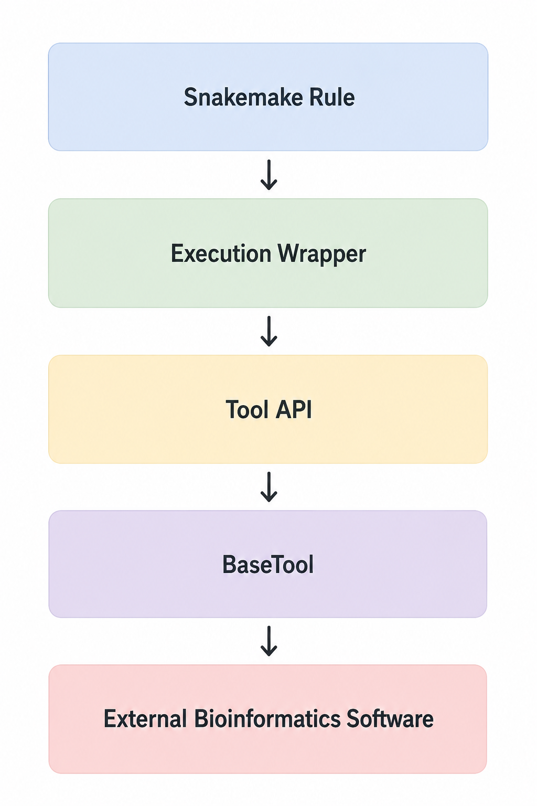
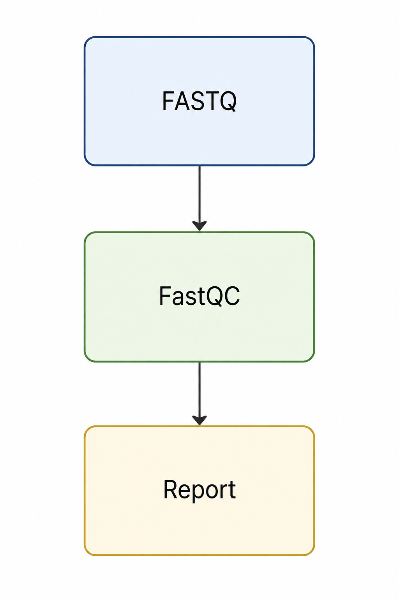
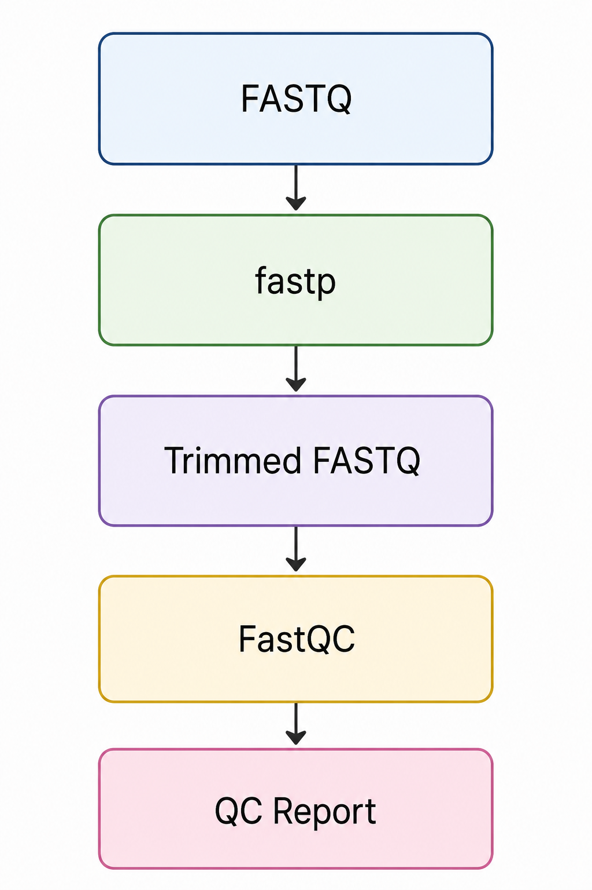
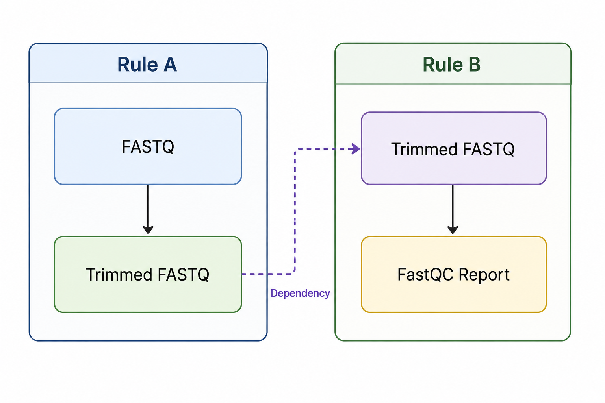

```{=typst}
#set page(
  paper: "us-letter",
  margin: (x:0.5in, y:0.5in)
)

#show link: set text(fill: blue)

#set text(
  font: "New Computer Modern",
  size: 11pt
)

#set par(justify: true)

#align(center)[

#v(2.5cm)

#text(size: 28pt, weight: "bold")[
Mitopipeline
]

#v(0.3cm)

#text(size: 18pt)[
Developer Manual
]

#v(0.5cm)

#text(size: 14pt, fill: gray)[
A Comprehensive Guide to Development, Architecture, and Extension
]

#v(2.0cm)

#text(size: 13pt)[
Prepared for
]

#v(0.2cm)

#text(size: 16pt, weight: "bold")[
Dr. Stuart
]

Department of Biology

Loyola University Chicago

#v(1.5cm)

#text(size: 13pt)[
Prepared by
]

#v(0.2cm)

#text(size: 16pt, weight: "bold")[
Emil Andre Cacayan
]

Master of Science in Bioinformatics

#v(2.5cm)

Version 1.0

#datetime.today().display("[month repr:long] [day], [year]")

#v(2cm)

#text(size: 11pt, fill: gray)[
This document describes the architecture, implementation,
testing strategy, and development workflow of the Mitopipeline
bioinformatics software package. It is intended for future
developers and researchers responsible for maintaining,
extending, or contributing to the project.
]

]
```


# Table of Contents

# Introduction
## Purpose of the Project
Hi! It's Emil Cacayan - I'm the author of this pipeline repository. This manual serves as a comprehensive walkthrough for future development of this pipeline and contains pretty much everything you need to know to get up to speed for implementation of additional tools, debugging, and coding standards contained within. Thanks to Dr. Yoel Stuart and the Stuart Lab for their support. This work would not be possible without them. 

The **mitopipeline** project is a modular bioinformatics workflow for the assembly, annotation, quality assessment, and downstream analysis of mitochondrial genomes from next-generation sequencing (NGS) data. The software was developed to automate a previously manual and fragmented analysis process while providing a reproducible, maintainable, and extensible platform for future research.

Unlike traditional bioinformatics workflows that rely heavily on standalone shell scripts, mitopipeline combines a workflow management system with a modular Python software architecture. Workflow orchestration is performed using [`Snakemake`](https://snakemake.readthedocs.io/), while individual bioinformatics applications are encapsulated within reusable object-oriented Tool APIs. This separation of concerns improves maintainability, simplifies testing, and provides a consistent interface for integrating additional software in the future.

The primary objective of this project is not only to automate mitochondrial genome analysis, but also to establish a software architecture that can continue evolving as research requirements change.

---

## Biological Motivation
Mitochondrial genomes are widely used in evolutionary biology, conservation genetics, environmental DNA (eDNA) studies, and species identification because they are relatively small, maternally inherited, and often exhibit high mutation rates compared to nuclear DNA. Accurate mitochondrial assemblies enable researchers to investigate phylogenetic relationships, assess biodiversity, identify species from environmental samples, and construct reference databases for future genomic analyses.

Generating these assemblies, however, requires the coordinated execution of numerous bioinformatics tools. Raw sequencing reads must undergo quality assessment, adapter trimming, mitochondrial genome assembly, annotation, and downstream comparative analyses before biologically meaningful results can be obtained. Each software package introduces its own dependencies, command-line interface, input requirements, and output formats, making manual execution both time-consuming and error-prone.

The mitopipeline addresses these challenges by automating the complete workflow while preserving reproducibility, standardization, and flexibility throughout the analysis process.

---

## Software Goals

The software was designed according to several guiding principles that influenced every architectural decision throughout the project.

**Reproducibility** ensures that identical input data and configuration files produce consistent analytical results across different computing environments. Workflow execution, software dependencies, and configuration parameters are therefore explicitly defined and version controlled.

**Modularity** separates independent software responsibilities into reusable components. Workflow orchestration, execution wrappers, Tool APIs, logging, manifest parsing, reporting, and statistical analyses are implemented as distinct modules that can evolve independently.

**Extensibility** enables future developers to integrate new bioinformatics applications, workflow stages, reporting capabilities, and downstream analyses without requiring substantial architectural redesign. Standardized interfaces and layered abstractions minimize coupling between software components while simplifying future development.

**Maintainability** emphasizes readable code, comprehensive testing, centralized configuration, and clear documentation. The project is intended to remain understandable and approachable for future developers, including those with strong bioinformatics backgrounds but limited experience in object-oriented software engineering.

---

## Intended Audience
This manual is intended for developers who wish to maintain, extend, or contribute to the mitopipeline project. It assumes familiarity with general bioinformatics concepts such as FASTQ files, reference genomes, sequence assembly, and command-line tools, but does not assume prior experience with object-oriented programming, software architecture, or [`Snakemake`](https://snakemake.readthedocs.io/).

Rather than serving solely as an API reference, this manual explains both *how* the software is implemented and *why* it was designed in its current form. Throughout the document, architectural decisions are accompanied by practical examples, code snippets, workflow diagrams, and references to relevant software documentation. By the conclusion of this manual, a developer should possess the knowledge necessary to understand the existing codebase, modify existing workflow stages, integrate new bioinformatics tools, and continue development of the project with confidence.

# High Level Architecture
The mitopipeline is organized as a layered software architecture. Rather than invoking bioinformatics software directly from the workflow engine, each layer has a single, well-defined responsibility. This separation improves maintainability, simplifies testing, and allows future developers to replace or extend individual components without affecting the remainder of the pipeline.

{ width=50% }

Each layer is described below.

---

## User
The user serves as the entry point to the pipeline. Rather than interacting directly with individual bioinformatics applications, the user prepares the biological data and configuration necessary to execute the workflow.

Typical responsibilities include:

- Preparing paired-end FASTQ files
- Creating or modifying a sample manifest
- Selecting an appropriate configuration file
- Executing the pipeline
- Reviewing the generated outputs

Once execution begins, responsibility passes to the workflow engine.

---

## Snakemake
[`Snakemake`](https://snakemake.readthedocs.io/) is responsible for orchestrating the entire workflow. It determines which pipeline stages must execute, resolves dependencies between them, provisions software environments, and schedules execution.

Snakemake **does not perform any biological analyses itself.** Instead, it decides **when** analyses should occur.

Responsibilities include:

- Constructing the workflow dependency graph (DAG)
- Executing rules in dependency order
- Managing Conda environments
- Supporting parallel execution
- Skipping completed stages

---

## Python Execution Wrapper
Execution wrappers provide the interface between Snakemake and the Python package.

Each Snakemake rule calls a small Python script located in

```text
src/mitopipeline/exec/
```

These wrappers remain intentionally lightweight.

Their responsibilities are limited to:

- reading Snakemake parameters
- loading configuration values
- constructing Tool API objects
- initiating execution

They contain very little business logic and primarily act as translators between Snakemake and the software architecture.

---

## Tool API
Each external bioinformatics application is represented by a dedicated Tool API class.

Current examples include:

- FastQC
- fastp
- GetOrganelle

Each Tool API understands how to interact with one specific application.

Typical responsibilities include:

- constructing command-line arguments
- validating inputs
- defining expected outputs
- exposing a consistent Python interface

This abstraction allows future developers to replace individual software packages without affecting the remainder of the pipeline.

---

## BaseTool
Every Tool API inherits from a common `BaseTool` class.

Rather than implementing common functionality repeatedly, `BaseTool` centralizes behavior shared across every external application.

Examples include:

- subprocess execution
- logging
- error handling
- command result management

Individual Tool APIs therefore implement only software-specific behavior while inheriting the common execution framework.

---

## External Bioinformatics Software
The final layer consists of the third-party applications that perform the biological analyses.

Current tools include:

- [`FastQC`](https://www.bioinformatics.babraham.ac.uk/projects/fastqc/)
- [`fastp`](https://github.com/OpenGene/fastp)
- [`GetOrganelle`](https://github.com/Kinggerm/GetOrganelle)

Future versions of the pipeline may incorporate additional tools for annotation, phylogenetic reconstruction, comparative genomics, statistical analyses, and sequence archival.

Because these applications are isolated behind Tool APIs, the remainder of the software remains independent of their implementation details.

---

```{=typst}
#align(center)[
#box(
  inset: 12pt,
  radius: 4pt,
  fill: rgb("#f2f2f2"),
  stroke: rgb("#cccccc"),
[
#strong[Key Takeaways]

- Snakemake orchestrates the workflow but performs no biological analyses.

- Execution wrappers connect Snakemake to the Python package.

- Tool APIs encapsulate individual bioinformatics applications.

- `BaseTool` provides shared execution functionality.

- External software performs the biological analyses.
])
]
```


# Repository Tour
The mitopipeline repository is organized according to software responsibility rather than individual workflow stages. Each top-level directory exists to isolate a specific aspect of the project, allowing workflow logic, Python software, testing, dependency management, and legacy implementations to evolve independently.

Understanding the purpose of each directory is considerably more valuable than memorizing its contents. Throughout development, a useful rule of thumb is:

> **If you know *what* you want to change, you should immediately know *which directory* to visit.**

The following sections describe the purpose of each major repository component.

---

## `ctrl/` — Workflow Orchestration

```{=typst}
#align(center)[
#box(
  inset: 12pt,
  radius: 4pt,
  fill: rgb("#f2f2f2"),
  stroke: rgb("#cccccc"),
[
#strong[Purpose]

Controls #strong[how] the pipeline executes.
])
]
```

The `ctrl/` directory contains the workflow definition for the entire pipeline. Rather than implementing biological analyses, this directory defines **when** each stage executes and how individual stages depend upon one another.

Workflow rules, configuration files, and stage definitions are intentionally isolated from the remainder of the Python package so that execution order can evolve independently of software implementation.

You should modify this directory when:

- adding a new workflow stage
- changing rule dependencies
- introducing a new configuration option
- modifying pipeline execution order

---

## `envs/` — Dependency Management

```{=typst}
#align(center)[
#box(
  inset: 12pt,
  radius: 4pt,
  fill: rgb("#f2f2f2"),
  stroke: rgb("#cccccc"),
[
#strong[Purpose]

Defines the software required to execute each workflow stage.
])
]
```

Each workflow stage executes within an isolated Conda environment.

Rather than installing every bioinformatics application into a single shared environment, the pipeline maintains independent environment specifications for each stage. This minimizes dependency conflicts while ensuring reproducible execution.

Most developers only interact with this directory when introducing a new bioinformatics application or updating software versions.

---

## `src/` — Pipeline Implementation

```{=typst}
#align(center)[
#box(
  inset: 12pt,
  radius: 4pt,
  fill: rgb("#f2f2f2"),
  stroke: rgb("#cccccc"),
[
#strong[Purpose]

Implements the software that powers the pipeline.
])
]
```

The `src/` directory contains the mitopipeline Python package.

Unlike `ctrl/`, which determines **when** software executes, `src/` defines **how** the pipeline behaves.

This directory contains the object-oriented implementation of the project, including:

- Tool APIs
- execution wrappers
- pipeline orchestration
- logging
- manifest parsing
- reporting
- statistics
- domain models

Most software development occurs within this directory.

If you are fixing bugs, implementing features, or integrating new tools, this is where you will spend most of your time.

---

## `tests/` — Software Validation

```{=typst}
#align(center)[
#box(
  inset: 12pt,
  radius: 4pt,
  fill: rgb("#f2f2f2"),
  stroke: rgb("#cccccc"),
[
#strong[Purpose]

Verifies that the pipeline behaves correctly.
])
]
```

The testing directory exists to provide confidence that changes made to the software do not introduce unintended behavior.

Rather than relying solely on manual execution, the pipeline includes automated unit tests, integration tests, and biological fixture datasets that validate both individual software components and complete workflow stages.

Whenever new functionality is added to the pipeline, corresponding tests should also be implemented.

As a general rule:

> New code should almost always be accompanied by new tests.

---

## `legacy/` — Historical Implementations

```{=typst}
#align(center)[
#box(
  inset: 12pt,
  radius: 4pt,
  fill: rgb("#f2f2f2"),
  stroke: rgb("#cccccc"),
[
#strong[Purpose]

Preserves the original research workflow.
])
]
```

Before the development of mitopipeline, mitochondrial genome analyses were performed using standalone shell scripts.

These scripts are preserved within the repository for historical reference and validation purposes. They document the original research workflow and provide a useful comparison against the modern software architecture.

Developers should generally avoid modifying these scripts unless reproducing previous analyses or validating historical behavior.

---

## Repository Philosophy

```{=typst}
#align(center)[
#box(
  inset: 12pt,
  radius: 4pt,
  fill: rgb("#f2f2f2"),
  stroke: rgb("#cccccc"),
[
#strong[Key Takeaways]

- `ctrl/` controls workflow execution.

- `envs/` manages software dependencies.

- `src/` contains the pipeline implementation.

- `tests/` verifies software correctness.

- `legacy/` preserves historical workflows.

Every directory exists to separate one software responsibility from another. This separation of concerns is one of the central architectural principles of the mitopipeline.
])
]
```

# Running the Pipeline
Before executing the mitopipeline, the required software dependencies must be installed and the Python package must be made available to the current environment. This section walks through the complete setup process from a fresh clone of the repository.

---

## Step 1. Clone the Repository
If the repository has not already been cloned, obtain the source code using Git.

```bash
git clone https://github.com/cacayan2/mitogenome-batch-processor.git
cd mitogenome-batch-processor
```

The first command downloads the project repository from GitHub onto your local machine. The second command changes the current working directory into the repository root, where all subsequent commands should be executed.

---

## Step 2. Create the Conda Environment
The pipeline depends upon numerous third-party bioinformatics applications and Python libraries. Rather than installing these globally, a dedicated Conda environment should be created.

```bash
conda env create -f envs/qc.yaml
```

This command creates a Conda environment using the software versions specified in the provided YAML file.

As the pipeline evolves, additional workflow stages may provide their own environment specifications. Snakemake will automatically create these environments during pipeline execution, but manually creating one is often useful during development and debugging.

---

## Step 3. Activate the Environment
Before executing Python commands, activate the Conda environment.

```bash
conda activate qc
```

Activating the environment modifies the current shell session so that Python and all required bioinformatics software are executed using the versions installed within the Conda environment rather than the system-wide installation.

You should verify that the environment is active before continuing.

---

## Step 4. Install the Python Package
The mitopipeline is distributed as an installable Python package.

During development, it should be installed in **editable mode**.

```bash
pip install -e .
```

The `-e` flag specifies an *editable installation*.

Unlike a normal installation, editable mode creates a link between the installed package and the source code within the repository. Changes made to the Python source files therefore become immediately available without requiring the package to be reinstalled after every modification.

This significantly improves the software development workflow.

---

## Step 5. Verify the Installation
A simple import test can be used to verify that the package has been installed correctly.

```bash
python -c "import mitopipeline"
```

If no output is produced and no error is raised, the package has been installed successfully.

---

## Step 6. Execute the Pipeline
The pipeline is executed through Snakemake.

A typical execution command is shown below.

```bash
snakemake \
    --snakefile ctrl/Snakefile \
    --configfile tests/fixtures/config/prod_config.yaml \
    --cores 8 \
    --use-conda
```

Each command-line option serves a specific purpose.

### `--snakefile`

Specifies the workflow definition to execute.

```text
ctrl/Snakefile
```

This file contains the complete workflow graph and defines the relationships between every pipeline stage.

---

### `--configfile`

Provides the configuration file used during execution.

```text
tests/fixtures/config/prod_config.yaml
```

Configuration files define execution parameters such as:

- input manifest
- output directory
- software parameters
- stage selection
- reference database locations

Separating configuration from workflow logic allows the same pipeline implementation to support multiple execution scenarios.

---

### `--cores`

Specifies the maximum number of CPU cores that Snakemake may use simultaneously.

```bash
--cores 8
```

Increasing the number of available cores allows independent workflow stages to execute in parallel whenever possible, reducing total runtime.

This value should generally be less than or equal to the number of physical CPU cores available on the machine.

---

### `--use-conda`

Enables automatic environment management.

When this option is specified, Snakemake creates and activates the Conda environments required by each workflow stage automatically.

Without this flag, the user would be responsible for manually installing every software dependency before pipeline execution.

---

## Typical Development Workflow
During routine development, the following commands are commonly executed.

```bash
conda activate qc

pip install -e .

pytest

snakemake \
    --snakefile ctrl/Snakefile \
    --configfile tests/fixtures/config/prod_config.yaml \
    --cores 8 \
    --use-conda
```

The first command activates the development environment.

The second ensures that any modifications to the Python package are immediately reflected during execution.

The third executes the automated test suite to verify that recent changes have not introduced regressions.

Finally, Snakemake executes the complete bioinformatics workflow.

---

```{=typst}
#align(center)[
#box(
  inset: 12pt,
  radius: 4pt,
  fill: rgb("#f2f2f2"),
  stroke: rgb("#cccccc"),
[
#strong[Key Takeaways]

- Clone the repository before beginning development.

- Activate the appropriate Conda environment before running Python commands.

- Always install the package using `pip install -e .` during development.

- Execute the workflow through Snakemake rather than calling individual scripts directly.

- Use `--use-conda` to allow Snakemake to manage software environments automatically.
])
]
```

# Snakemake for Beginners
If you are new to Snakemake, this chapter is one of the most important sections of this manual.

Many bioinformatics analyses consist of a sequence of independent computational steps. For example, sequencing reads may first undergo quality assessment before being trimmed, assembled, annotated, and analyzed. Each stage depends upon the successful completion of one or more previous stages.

One approach would be to execute every program manually in the correct order.

{ width=50% }

This approach quickly becomes difficult to maintain as workflows grow larger.

A more realistic analysis might resemble:

{ width=50% }

Eventually, dozens of workflow stages may exist, each producing files required by downstream analyses.

Managing this process manually is both tedious and error-prone.

[`Snakemake`](https://snakemake.readthedocs.io/) solves this problem by treating the workflow as a graph of file dependencies rather than a sequence of commands.

The developer specifies **what files are produced** by each workflow stage. Snakemake automatically determines:

- which stages need to execute
- the order in which they execute
- which stages may run simultaneously
- which stages can be skipped because outputs already exist

The developer therefore describes the workflow, while Snakemake determines the execution strategy.

---

## A Snakemake Rule

Every pipeline stage is described by a **rule**.

A simplified FastQC rule is shown below.

```python
rule fastqc_raw:

    input:
        "reads/{sample}_R1.fastq.gz"

    output:
        "qc/raw/{sample}_fastqc.html"

    conda:
        "../../envs/qc.yaml"

    script:
        "../../src/mitopipeline/exec/run_fastqc_raw.py"
```

Each section of the rule has a specific purpose.

---

## `input`

The `input` section defines the files required before the rule can execute.

```python
input:
    "reads/{sample}_R1.fastq.gz"
```

Snakemake continuously tracks these files while constructing the workflow graph.

If an input file does not exist, Snakemake searches for another rule capable of producing it.

---

## `output`

The `output` section specifies the files generated by the rule.

```python
output:
    "qc/raw/{sample}_fastqc.html"
```

These outputs become inputs to downstream workflow stages.

Because Snakemake tracks output files rather than program execution, it knows when a rule has already completed successfully.

---

## `conda`

The `conda` directive specifies the software environment required to execute the rule.

```python
conda:
    "../../envs/qc.yaml"
```

When the workflow is executed using

```bash
--use-conda
```

Snakemake automatically creates and activates the specified environment before running the rule.

This allows different workflow stages to use independent software environments without manual intervention.

---

## `script`

The `script` directive specifies the Python code responsible for executing the workflow stage.

```python
script:
    "../../src/mitopipeline/exec/run_fastqc_raw.py"
```

Notice that Snakemake **does not execute FastQC directly**.

Instead, it executes the Python wrapper.

The wrapper constructs the appropriate Tool API, which ultimately invokes the external software.

This design keeps workflow orchestration separate from software implementation.

---

## Wildcards

One of Snakemake's most powerful features is the use of **wildcards**.

Consider the input

```python
reads/{sample}_R1.fastq.gz
```

The value inside braces

```text
{sample}
```

is a wildcard.

Suppose the manifest contains

```text
lemon_shark_001

common_carp_001

sea_chub_002
```

Snakemake automatically expands the rule into

```text
reads/lemon_shark_001_R1.fastq.gz

reads/common_carp_001_R1.fastq.gz

reads/sea_chub_002_R1.fastq.gz
```

No additional programming is required.

The same rule therefore processes every biological sample in the dataset.

---

## Dependencies

Snakemake determines dependencies by comparing rule outputs to rule inputs.

Consider two workflow stages.

{ width=50% }

Rule B cannot begin until Rule A has completed because its input file does not yet exist.

The developer never explicitly writes

> Run Rule A before Rule B.

Instead, the dependency is inferred automatically from the filenames.

---

## Directed Acyclic Graph (DAG)

Internally, Snakemake converts the workflow into a **Directed Acyclic Graph (DAG).**

Each node represents a rule.

Each edge represents a file dependency.

For example,

{ width=50% }

Snakemake analyzes this graph before execution begins.

Once the graph has been constructed, Snakemake determines:

- which rules are required
- which rules may execute simultaneously
- which rules have already completed
- which outputs are missing

This process occurs automatically every time the pipeline is executed.

---

## Why Snakemake?

Without a workflow engine, developers must manually execute each stage of the analysis and carefully remember the correct execution order.

As workflows become larger, this approach becomes increasingly difficult to maintain.

Snakemake eliminates this burden by allowing developers to focus on describing the workflow rather than controlling its execution.

This separation between **workflow definition** and **workflow execution** is one of the central architectural principles of the mitopipeline.

---

```{=typst}
#align(center)[
#box(
  inset: 12pt,
  radius: 4pt,
  fill: rgb("#f2f2f2"),
  stroke: rgb("#cccccc"),
[
#strong[Key Takeaways]

- A Snakemake rule describes one stage of the workflow.

- Rules specify inputs and outputs rather than execution order.

- Wildcards allow one rule to process many biological samples.

- Dependencies are inferred automatically from file names.

- Snakemake builds a Directed Acyclic Graph (DAG) before execution.

- The DAG determines the order in which rules execute.

- Developers describe the workflow; Snakemake determines how to execute it.
])
]
```